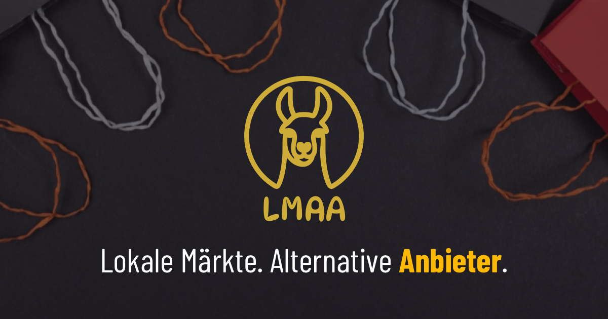

# lmaa.space

<!-- BADGES:START -->

<!-- BADGES:END -->

  

## Lokale Märkte. Alternative Anbieter.

[lmaa.space](https://lmaa.space) ist ein kuratiertes Verzeichnis unabhängiger Online-Shops als Alternativen zu großen Plattformen und reinen Marktplätzen in Europa.

Aktuell sind über 540 Shops in 45+ Kategorien gelistet. Alle Einträge werden manuell geprüft und kuratiert. Das Projekt ist nicht kommerziell, werbefrei und unabhängig.

## Shops vorschlagen

Einen neuen Shop kann jeder ohne Registrierung [direkt einreichen](https://lmaa.space/suggestion). Jeder Vorschlag wird anhand der [Aufnahmekriterien](https://lmaa.space/admissioncriteria) geprüft.

## Öffentliches API

Die Shop- und Kategorie-Daten stehen über ein öffentliches REST-API zur Verfügung. Die vollständige Dokumentation mit allen Endpoints, Schemas und einer Try-it-out-Funktion gibt es unter [api.lmaa.space](https://api.lmaa.space).

## Quellcode

Das Projekt ist als npm-Monorepo aufgebaut: Astro SSR + React Islands für die öffentliche Seite, ein React-Dashboard für die Administration, ein Hono-Backend mit PostgreSQL/Drizzle ORM und geteilte Pakete für Typen, API-Schemas und UI-Komponenten.

## Fehler melden und Anregungen

Fehler, Anregungen und Verbesserungsvorschläge sind willkommen. Bitte nutze dafür die [GitHub Issues](https://github.com/phranck/lmaa.space/issues).

## Ursprungsprojekt

lmaa.space basiert auf der ursprünglichen Liste [Amazon-Alternativen](https://codeberg.org/phranck/Amazon-Alternativen) auf Codeberg.

## Unterstützen

lmaa.space ist ein privates Community-Projekt ohne kommerzielle Interessen.

